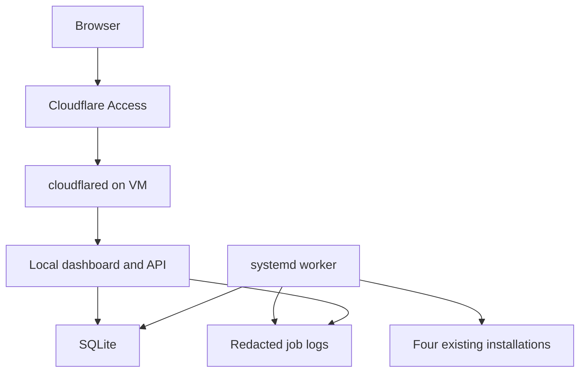

# EGA Update Console: V1 technical specification

Status: implementation contract, pending environment inventory.
Date: 2026-09-08.
Companion: [PRD and acceptance criteria](<PRD-UPDATE SYSTEM.md>).

## 1. Contract

Implement the PRD's four-tool manual update flow on one Ubuntu VM. This file defines mechanisms; [PRD-UPDATE SYSTEM.md](<PRD-UPDATE SYSTEM.md>) defines scope and acceptance. Conflicts must be resolved explicitly before implementation. Repository AGENTS.md still applies.

V1 uses React, TypeScript, and Vite for a static frontend; FastAPI for the API and static files; SQLite for durable state; and a separate Python worker under systemd. Pin dependencies and commit lockfiles. Do not introduce Redis, Kubernetes, cloud databases, or an AI execution layer.

## 2. Deployment topology

- One same-origin hostname. FastAPI serves compiled frontend assets and /api/v1.
- Bind API to 127.0.0.1 on a configured port. Route only that hostname through a persistent Cloudflare Tunnel.
- Protect the whole hostname with Access. Bypass caching for API and authenticated responses.
- No Cloudflare Worker or Pages deployment is required.
- Run API under a dedicated non-root account. Run worker under the existing tool-owner account, expected to be ubuntu but verified during inventory.
- The worker receives jobs from SQLite, never from a public listener. The API can write validated job requests but cannot modify adapter code or worker configuration.
- Shared database/log permissions are limited to the two service accounts. Secrets stay outside shared storage. No blanket sudo or shell endpoint.
- Same-user processes are not an isolation boundary against a compromised tool-owner account. This is a personal VM console, not a hostile multi-tenant executor.

Suggested layout, adjusted once for the inventoried owner and filesystem:

| Path | Content |
| --- | --- |
| /opt/ega-update/releases/<commit>/ | Immutable console code, built frontend, dedicated Python environment |
| /opt/ega-update/current | Active release pointer |
| /etc/ega-update/ | Owner-managed configuration and protected secrets |
| /var/lib/ega-update/state.db | SQLite state, outside releases |
| /var/lib/ega-update/logs/<job-id>.jsonl | Redacted ordered logs |
| /var/lib/ega-update/backups/ | Restricted backups and manifests |

## 3. Inventory before mutation

Produce inventory.json without credentials. Record each tool's absolute executable path and resolved target, install kind, owner, version/commit, source checkout status, runtime paths, service units, state directories, update channel, activity probe, verification probes, and backup procedure.

Record existing cron, systemd timers, and tool self-update settings that could overlap. The console lock cannot protect against unrelated SSH commands or external updaters. Document this limitation and disable only confirmed conflicting automation during setup.

Choose and implement one actual installation method per tool. Unsupported or ambiguous installations stay read-only with a reason. Completing V1 requires all four configured methods to be supported.

## 4. Authentication and request boundary

Validate Cf-Access-Jwt-Assertion with a maintained JWT library, configured issuer, fixed audience, allowed signing algorithm, expiry, and allowed owner identity. Retrieve signing keys only from the configured Cloudflare issuer; cache and refresh for rotation. Fail closed when validation cannot be established. Never trust an email header alone.

All API routes require authentication, including reads and log downloads. Mutations require JSON, an exact allowed Origin, and a CSRF token tied to the authenticated subject. CORS is disabled. Never mutate through GET. Reauthentication does not affect active jobs.

Apply request size limits, bounded pagination, and basic per-identity rate limits. Validate IDs, enum fields, and plan expiry. Use parameterized SQL and subprocess argument arrays with shell=False. Render logs as text, never HTML.

## 5. Adapter interface

Each fixed adapter implements:

- inspect(): installation identity, version, source cleanliness, runtime and service metadata.
- discover(): supported available target and channel, or explicit unknown.
- activity(): idle, busy, or unknown, plus evidence and timestamp.
- plan(): server-owned target, restart impact, backup scope, required space, supported steps and timeouts.
- backup(): consistent backup or a declared unsupported result.
- execute(): fixed executable and argument arrays for the configured install method.
- verify(): structured mandatory check results and resulting version.

Adapter code is version-controlled. Browser requests cannot supply executable paths, environment variables, service names, URLs, or command arguments.

| Tool | Required implementation behavior |
| --- | --- |
| Hermes | Detect updater capabilities locally. Use the supported noninteractive procedure and backup options. Dirty checkout blocks. Record channel and resulting commit; main-tracking updates are explicitly labeled as such. Verify CLI diagnostics and configured gateways. |
| OpenCode | Use the existing supported installer and explicit discovered target where available. Verify version and CLI startup; verify server only when configured. |
| Codex | Preserve the detected installation method. Verify version and CLI startup plus any configured persistent service. Do not automatically re-pair remote control or modify authentication. |
| T3 | Support its inventoried package or source installation. Pin runtime launch to the installed version, avoiding latest resolution on every restart. Verify HTTP readiness and the available non-generating Codex integration probe. |

After a Codex update, run configured T3 integration checks. If no reliable non-generating integration probe exists, report that coverage limitation and perform a documented manual integration check for release acceptance. Do not label a generic HTTP 200 as proof of provider functionality.

Installed-version pinning and runtime compatibility are verified separately. A shared runtime upgrade requirement blocks the job and becomes manual maintenance.

## 6. Plans and activity

A plan expires after 5 minutes and records the installation fingerprint, channel, target semantics, affected services, backup scope, and activity evidence. Exact-version adapters must install that target. A supported main-tracking updater may resolve a newer commit; the UI must disclose this behavior and record the actual result.

At execution, recheck fingerprint, activity, disk, and source cleanliness before mutation. Changed installation or stale plan requires a fresh plan. Busy blocks. Unknown requires the plan-specific owner acknowledgment, recorded on the job. Never equate service running with an active task or idle session.

No forced update of detected active work in V1. Session detection cannot eliminate races with work started outside the console; explain the interruption risk in the preview and recheck immediately before mutation.

## 7. Persistent data

Use SQLite WAL on a local filesystem, foreign keys, migrations, busy timeout, and short transactions. Never hold a database transaction during a subprocess.

| Entity | Required fields |
| --- | --- |
| tools | id, install identity, observed version, available target/channel, observation time, discovery error |
| plans | id, tool id, subject, created/expires timestamps, installation fingerprint, target semantics, activity evidence, backup/restart summary |
| jobs | UUID, tool/plan id, subject, idempotency key, state, step, before/after version, created/started/finished timestamps, exit code, error code, acknowledgment, runner unit, heartbeat, recovery flag |
| checks | id, tool/job id, name, pass/fail/unknown/not-applicable, mandatory flag, summary, timestamp |
| backups | id, job id, restricted path, scope, consistency method, size, completion time |
| events | sequence, job id, timestamp, event type, redacted state-change details |

Unique constraint on subject plus idempotency key. Enforce at most one nonterminal update job using a database constraint or equivalent transactional reservation. Same key and same payload returns the original job; same key with different payload returns 409.

Observed health and historical job outcomes are independent. Manual refresh never rewrites a terminal job.

## 8. Job execution and crash recovery

States: accepted -> preflight -> backup -> updating -> verifying -> succeeded.
Terminal alternatives: blocked, failed, health_failed, interrupted. Steps may be not-applicable only when the adapter explicitly defines this before execution.

The API transaction reserves the single active slot. Worker claims within 10 seconds or marks the job blocked as worker unavailable before mutation. This slot is a dispatch handoff, not a user queue. Competing requests receive 409 immediately.

Use a singleton worker and a VM file lock. Execute each job in a named systemd service under the tool owner. The job runner owns the lock for the full procedure; updater descendants remain in its cgroup. Persist the unit name before dispatch. A dispatch retry inspects that name instead of spawning a duplicate.

- API restart: independent runner continues.
- Dispatcher restart: inspect job unit and resume observation, never re-execute.
- Runner crash: systemd terminates remaining cgroup processes. Reconcile unit state; record interrupted unless a persisted completion receipt proves the outcome.
- VM reboot: do not resume update steps automatically. Inspect remaining state and mark interrupted if completion is unproved.
- Unresolved process state: keep recovery_required set and block new jobs.
- Terminal state alone does not clear a live runner or recovery block.

Provide an SSH-only reconcile command that inspects units/processes, probes the installation, and clears recovery only after no updater remains. Record the action. Never clear a lock just because a heartbeat is old.

Known preflight problems produce blocked. Installer nonzero exit produces failed even if the old version remains healthy. Zero exit followed by mandatory check failure produces health_failed. Missing required verification cannot produce succeeded.

Use per-step configured timeouts. No inactivity-only kill. For a hard timeout, terminate the job cgroup gracefully, then forcibly after a configured grace period; record possible partial installation and run bounded recovery checks. No retry and no browser cancellation in V1.

## 9. Logs, backups, and storage

Capture stdout/stderr incrementally through a streaming decoder. Buffer incomplete lines before redaction, cap line length, strip terminal control sequences, and replace known secrets plus credential/header patterns before writing anywhere. Do not persist raw output or enable shell tracing. Test secret fragments across read boundaries. Redaction is best-effort, so logs remain private.

Use per-job increasing sequence numbers. Flush complete JSONL records at least every second. Tolerate a partial final record after a crash. Poll active logs every 2 seconds using an after cursor; page reload starts from retained history. Emit an explicit gap/truncation marker. Flush output before publishing final completion.

Default limits: 20 MiB per job, 500 MiB total retained logs, 30 days of completed logs, and 90 days of job metadata. Stop persisting excess output but continue draining pipes and show truncation. Never delete active-job data.

Before mutation require at least max(2 GiB, estimated temporary install + backup bytes + 1 GiB) free on every affected filesystem. Unestimable backup size blocks until configured conservatively. Required backup failure blocks installation.

Backup scope must identify covered config/state, omitted content, and consistency method. Quiesce writers or use a supported consistent database backup procedure; copying a live database file alone is insufficient. Protect credentials in backups. Retain the latest two completed backups per tool; do not delete the current job's backup or unresolved-failure backups automatically. Disk pressure blocks updates rather than silently deleting recovery data.

Database write failure before mutation blocks. During execution, preserve the redacted runner receipt on disk where possible and mark recovery required after reconciliation. Never return success without a durable completion record.

## 10. API contract

All routes below use /api/v1 and authenticated responses use Cache-Control: no-store.

| Method and route | Contract |
| --- | --- |
| GET /session | Owner identity and CSRF token |
| GET /tools | Four cards with independent observations and freshness |
| POST /tools/{id}/check | Bounded read-only version, discovery, and health refresh; coalesce duplicates |
| POST /tools/{id}/plans | Create 5-minute server-owned preview; no installation |
| POST /jobs | plan_id and activity acknowledgment; Idempotency-Key header required; 202 plus job ID |
| GET /jobs?cursor=... | Paginated history, default 25, maximum 100 |
| GET /jobs/{id} | State, step, timings, checks, backup summary, errors |
| GET /jobs/{id}/logs?after=...&limit=... | Ordered redacted records, next cursor, truncation flag; bounded response |
| GET /health | Authenticated API/database/worker readiness summary |

Errors use {code, message, details, request_id}. Use 401 for missing/invalid authentication, 403 for denied identity or CSRF, 409 for busy/stale/conflicting requests, 422 for invalid input, and 503 for unavailable worker/storage. Never include secrets in details.

Read-only checks during mutation return cached observations labeled stale or updating. They must not launch probes that contend with the updater. Discovery refresh is cached for 15 minutes; startup and explicit refresh can populate it. No timer installs updates.

## 11. UI contract

One overview, one update preview, one job detail panel, and paginated history. Show the PRD fields and last-checked timestamps. Health older than 5 minutes is labeled stale. Unreachable API displays disconnected, never cached green as current.

Update is disabled while any job is active or recovery is required. Unknown-activity acknowledgment is unchecked by default. Logs have auto-follow, pause-follow, and plain-text copy. Do not expose a shell input or a misleading percentage.

Use named health checks such as CLI startup passed or Gateway running. No claim that model inference works without testing it. Display installation and health results independently.

## 12. Deployment and recovery

1. Complete inventory and configure owner, domain, Access issuer/audience/identity, paths, service units, and adapter timeouts.
2. Build a pinned console release. Install it without modifying existing tool state. Create restricted persistent directories and migrate SQLite after a consistent DB backup.
3. Install API, dispatcher, job-runner template, and persistent cloudflared service. Ensure tool-owner user services work without an interactive SSH session where required.
4. Configure Access before publishing the hostname. Validate origin JWT checks and localhost binding. Preserve existing SSH access.
5. Verify read-only state. Remove only identified conflicting updater schedules, recording the prior configuration for restoration.
6. Run adapter acceptance, failure tests, and reboot/reconnect checks. Publish the evidence matrix.

Console deployment requires no active update. Switch the release pointer and restart console services. Preserve database/log directories. Roll back console code only when its database schema is compatible; otherwise follow the documented migration recovery procedure. Never automatically restore tool data.

The runbook must cover Access/tunnel failure, stopped API, stopped worker, disk exhaustion, interrupted jobs, partial tool updates, and manual health refresh. The owner uses SSH or the provider console if the web path fails.

## 13. Verification and deliverables

Deliver frontend/backend source, four adapters, migrations, unit files, install/upgrade scripts, example configuration without secrets, inventory schema, recovery runbook, and acceptance evidence mapped to AC-01 through AC-15.

Automated tests must exercise actual risk: concurrent job reservation, repeated idempotency keys, forged JWTs, CSRF, command injection, secret redaction across chunks, state transitions, subprocess failure, worker restart, timeout, storage failure, and log cursor replay.

Use disposable fake installers for fault injection. Never deliberately corrupt a live tool to test recovery. Then verify each real adapter on the VM and test the deployed UI through Cloudflare. Record commit, environment, before/after version, and evidence for each result. No fabricated passes; pending gates mean V1 is not accepted.

## 14. Source references

Checked 2026-09-08. Confirm installed capabilities during implementation; these links do not prove the VM has the latest features.

- [Cloudflare Tunnel](https://developers.cloudflare.com/tunnel/): outbound connector and hostname routing.
- [Access token validation](https://developers.cloudflare.com/cloudflare-one/access-controls/applications/http-apps/authorization-cookie/validating-json/): validate signed application tokens and audience.
- [Hermes updating](https://hermes-agent.nousresearch.com/docs/getting-started/updating): update planning, backup, diagnostics, and installation-specific behavior.
- [OpenCode CLI](https://opencode.ai/docs/cli/): version-targeted upgrade support.
- [Codex CLI](https://learn.chatgpt.com/docs/codex/cli): installation entry point; preserve the inventoried method.
- [T3 repository](https://github.com/pingdotgg/t3code): runtime and package/source installation reference.
- [systemd-run](https://www.freedesktop.org/software/systemd/man/systemd-run.html): independently managed command execution.
